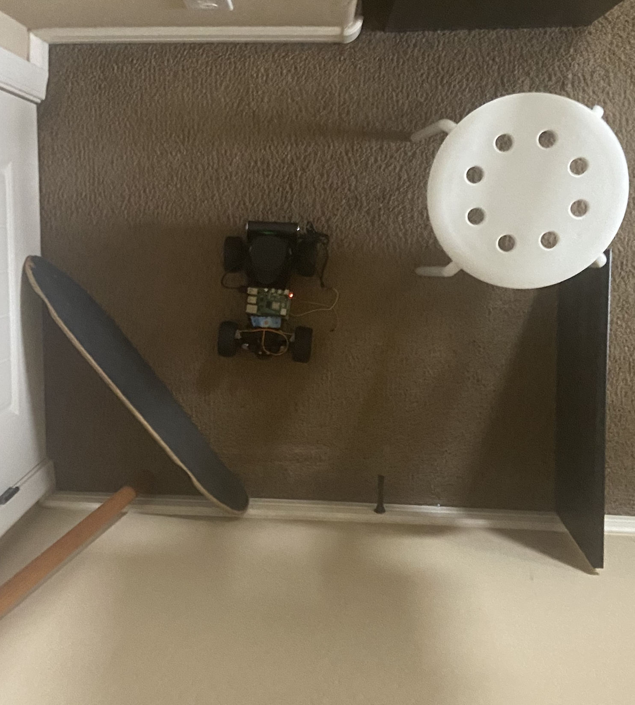

# 🚗 Autonomous RC Car 

  
  

## 📖 About
This project is my take on building an autonomous RC car — using a Raspberry Pi, LiDAR, an IMU, and a lot of trial and error!
The goal was to make a mini self-driving car that could:
- Sense obstacles,
- Steer and drive on its own,
- And learn how real-world robotics systems work under the hood.

Huge credit and inspiration goes to [Steven Gong's YouTube video](https://www.youtube.com/watch?v=R87Qlq_wSY8), which gave me the idea and a starting point for the project.
(I built on those concepts and customized the system with my own hardware setup and code.)

This project has been an amazing learning experience and I'm excited to keep improving it in the future!

## ✨ Features
🔍 Obstacle Detection — real-time 360° scanning with RPLidar

🎯 Precise Steering Control — PWM-based servo steering

🛞 Throttle Management — DC motor speed control with L298N

🧭 Orientation Awareness — MPU6050-based tilt sensing

📈 Live Visualization (matplotlib)

🧠 Multithreaded Architecture for sensor and actuator synchronization

## 🛠 Hardware Used

| Component              | Details                     |
| :--------------------- | :-------------------------- |
| **Raspberry Pi**       | Model 4B                    |
| **RPLidar**            | A1 Model                    |
| **MPU6050**            | Gyroscope + Accelerometer   |
| **L298N Motor Driver** | Dual H-Bridge Controller    |
| **DC Motor**           | Brushed type, PWM control   |
| **Servo Motor**        | 5V, standard rotation range |
| **RC Car Chassis**     | Pre-built                   |
| **Power Supply**       | 5V for motors and servos    |

## 🖥 Software Stack
Language: Python 3.9+

### Key Libraries:
- rplidar
- smbus / smbus2
- RPi.GPIO
- numpy
- matplotlib

# 🔌 Wiring Diagram

  

# 📊 Example Outputs
## LiDAR Mapping	

  
  

  
  

MPU6050 Tilt Data
(Insert IMU graph here)

# 🧩 Future Improvements
-  Path Planning and basic route optimization
-  SLAM Integration (Simultaneous Localization and Mapping)
-  Power Optimization for longer outdoor use
-  Web Dashboard for live telemetry viewing
